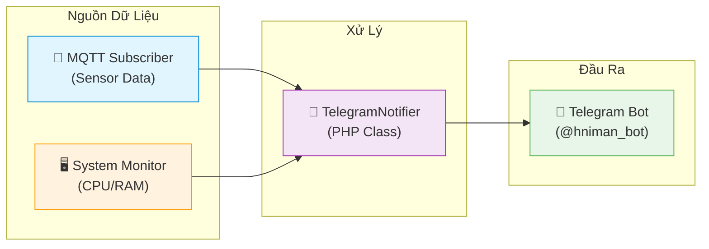
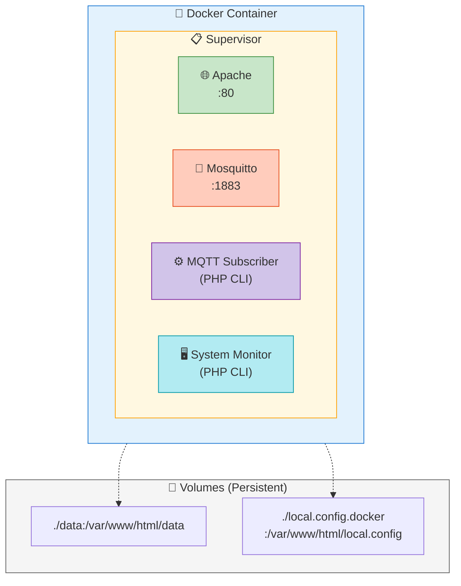

# BÁO CÁO CHI TIẾT: HỆ THỐNG GIÁM SÁT MÔI TRƯỜNG IOT CỤC BỘ TRÊN NỀN TẢNG RASPBERRY PI

## CHƯƠNG 1: TỔNG QUAN & MỤC TIÊU ĐỀ TÀI

### 1.1. Đặt Vấn Đề & Bối Cảnh
Trong kỷ nguyên Internet of Things (IoT), việc giám sát các thông số môi trường như nhiệt độ và độ ẩm đóng vai trò quan trọng trong nhiều lĩnh vực, từ nông nghiệp thông minh, bảo quản kho bãi đến giám sát điều kiện sống trong gia đình. Tuy nhiên, đa số các giải pháp thương mại hiện nay phụ thuộc vào nền tảng Cloud (đám mây), gây ra các lo ngại về:
-   **Độ trễ (Latency):** Dữ liệu phải đi vòng qua server quốc tế.
-   **Quyền riêng tư (Privacy):** Dữ liệu nhạy cảm được lưu trữ bởi bên thứ ba.
-   **Phụ thuộc Internet:** Mất mạng đồng nghĩa với mất khả năng giám sát.

Đồ án này tập trung giải quyết các vấn đề trên bằng cách xây dựng một hệ thống **IoT Gateway cục bộ (Local IoT Gateway)**, hoạt động hoàn toàn trong mạng LAN, đảm bảo tốc độ cao, bảo mật và tự chủ dữ liệu.

### 1.2. Mục Tiêu Cụ Thể & Tiêu Chí Kỹ Thuật
Dựa trên yêu cầu thiết kế (`YeuCau.txt`), hệ thống phải đạt được các chỉ số hiệu năng nghiêm ngặt:
1.  **Tính Real-time:** Tốc độ thu thập dữ liệu từ Node cảm biến ≤ 2 giây/lần.
2.  **Độ Tin Cậy:** Tỷ lệ kết nối thành công ≥ 95% trong môi trường mạng nội bộ.
3.  **Hiệu Năng Truyền Tải:** Độ trễ từ lúc cảm biến đọc đến khi hiển thị trên Gateway ≤ 500ms.
4.  **Giao Diện:** Dashboard trực quan, cập nhật dữ liệu tức thời mà không cần tải lại trang thủ công (thông qua cơ chế fetch API tối ưu).

---

## CHƯƠNG 2: KIẾN TRÚC HỆ THỐNG

Hệ thống được thiết kế theo mô hình **Hub-and-Spoke (Mô hình Sao)** tập trung, với Raspberry Pi đóng vai trò là trung tâm xử lý (Hub) và các thiết bị ESP32 là các vệ tinh (Spokes).

### 2.1. Sơ Đồ Khối Chức Năng
Hệ thống chia làm 3 tầng (layers) rõ rệt:

1.  **Tầng Thiết Bị (Edge Layer):**
    -   Bao gồm các Node thu thập dữ liệu.
    -   Nhiệm vụ: Đọc cảm biến, xử lý tín hiệu số, đóng gói dữ liệu và gửi đi.
    -   Đại diện: **ESP32 + DHT22**.

2.  **Tầng Hạ Tầng & Truyền Thông (Infrastructure & Network Layer):**
    -   Nhiệm vụ: Trung chuyển tin nhắn giữa các thiết bị và server.
    -   Giao thức: **MQTT (Message Queuing Telemetry Transport)** chạy trên nền TCP/IP WiFi.
    -   Thành phần: **Mosquitto Broker** (chạy trên Raspberry Pi).

3.  **Tầng Ứng Dụng & Lưu Trữ (Application & Storage Layer):**
    -   Nhiệm vụ: Xử lý nghiệp vụ, lưu trữ lâu dài và hiển thị.
    -   Thành phần: **PHP Subscriber Service**, **SQLite Database**, **Apache Web Server**.

---

## CHƯƠNG 3: CÔNG NGHỆ CỐT LÕI (TECH STACK)

### 3.1. Phần Cứng (Hardware)
*   **Gateway - Raspberry Pi 4 Model B:**
    -   Lý do chọn: Có khả năng chạy hệ điều hành Linux đầy đủ (Debian Bookworm), hỗ trợ đa nhiệm tốt để chạy đồng thời Broker, Web Server và Database. Kết nối mạng ổn định qua Ethernet/WiFi.
*   **Node - ESP32-C3 SuperMini:**
    -   Lý do chọn: Vi điều khiển 32-bit mạnh mẽ, tích hợp sẵn WiFi/Bluetooth, kích thước cực nhỏ gọn, tiêu thụ năng lượng thấp hơn dòng ESP32 tiêu chuẩn, phù hợp cho các thiết bị chạy pin.
*   **Cảm Biến - DHT22 (AM2302):**
    -   Đặc điểm: Cảm biến số (Digital), dải đo rộng (-40 đến 80°C, 0-100% RH), độ chính xác cao hơn DHT11. Giao tiếp qua 1 dây (One-wire protocol).

### 3.2. Phần Mềm (Software)
*   **Giao thức MQTT v3.1.1:**
    -   Lựa chọn tối ưu cho IoT nhờ header gói tin nhỏ (tối thiểu 2 bytes), hỗ trợ các mức chất lượng dịch vụ (QoS). Trong đồ án này sử dụng **QoS 1 (At least once)** để đảm bảo dữ liệu không bị mất khi truyền.
*   **Backend - PHP 8.2 & Systemd:**
    -   Sử dụng PHP ở chế độ CLI (Command Line Interface) để viết các script chạy nền (Daemon). Kết hợp với Systemd của Linux để quản lý tiến trình, tự động khởi động lại khi gặp lỗi.
*   **Database - SQLite 3:**
    -   Cơ sở dữ liệu dạng file (Serverless). Không cần cài đặt server cồng kềnh như MySQL. Hỗ trợ đầy đủ SQL chuẩn, giao dịch (Transactions) và truy vấn nhanh cho lượng dữ liệu vừa phải (dưới 100GB).
*   **Frontend - Chart.js & Bootstrap:**
    -   Chart.js 2.9.3: Thư viện vẽ biểu đồ Canvas nhẹ, hiệu năng cao.
    -   Bootstrap 5: Hệ thống Grid system giúp giao diện hiển thị tốt trên cả Mobile và Desktop.

---

## CHƯƠNG 4: QUY TRÌNH HOẠT ĐỘNG (WORKFLOW)

Quy trình xử lý một gói tin dữ liệu từ cảm biến đến màn hình người dùng diễn ra như sau:

1.  **Thu Thập (Sensing):**
    -   ESP32 kích hoạt cảm biến DHT22.
    -   DHT22 mất khoảng 250ms để chuyển đổi tín hiệu tương tự sang số và gửi về ESP32.
2.  **Đóng Gói (Serialization):**
    -   ESP32 tạo một bản tin JSON: `{"device_id": "ESP32_01", "temp": 28.5, "hum": 60.2, "batt": 95, "rssi": -45}`.
    -   JSON được chọn vì tính phổ biến, dễ đọc (human-readable) và dễ parse ở mọi ngôn ngữ lập trình.
3.  **Phát Tán (Publishing):**
    -   ESP32 gửi bản tin này đến topic `iot/sensors` trên Broker (192.168.137.87).
4.  **Trung Chuyển & Tiếp Nhận (Routing & Ingestion):**
    -   Mosquitto Broker nhận tin, kiểm tra danh sách Subscriber.
    -   Dịch vụ `mqtt-subscriber.php` (đang lắng nghe topic này) nhận được chuỗi JSON.
5.  **Lưu Trữ (Persisting):**
    -   PHP script giải mã JSON.
    -   Thêm trường `received_at` (thời gian server nhận tin).
    -   Thực thi câu lệnh SQL `INSERT` vào bảng `sensor_data` trong SQLite.
6.  **Truy Xuất (Retrieval):**
    -   Người dùng nhấn "Reload" trên Dashboard.
    -   Trình duyệt gọi API `GET /backend/api_iot.php?action=latest`.
    -   API truy vấn bản ghi mới nhất từ SQLite và trả về JSON.
    -   JavaScript cập nhật DOM và vẽ lại biểu đồ.

---

## CHƯƠNG 5: CHI TIẾT TRIỂN KHAI KỸ THUẬT

### 5.1. Firmware ESP32 (Logic Xử Lý)
Firmware không chỉ đơn thuần là đọc và gửi, mà được thiết kế với tư duy **"Fail-safe"** (An toàn trước lỗi):
-   **Cơ chế Reconnect thông minh:** Sử dụng vòng lặp kiểm tra trạng thái kết nối (`client.connected()`). Nếu mất kết nối WiFi hoặc MQTT, thiết bị sẽ không bị treo mà sẽ thử kết nối lại sau mỗi 5 giây.
-   **Non-blocking Timer:** Thay vì dùng hàm `delay(2000)` làm dừng toàn bộ vi điều khiển, firmware sử dụng so sánh thời gian `millis() - lastMsgTime > 2000`. Điều này cho phép ESP32 duy trì kết nối mạng (keep-alive ping) ngay cả trong khoảng thời gian chờ giữa 2 lần đọc cảm biến.
-   **Giám sát phần cứng:** Ngoài nhiệt độ/độ ẩm, firmware còn đọc điện áp pin (qua bộ phân áp ADC) và cường độ sóng WiFi (RSSI) để giúp người quản trị đánh giá "sức khỏe" của Node.

### 5.2. Backend Daemon (PHP Subscriber)
Đây là trái tim của hệ thống xử lý dữ liệu:
-   **Kiến trúc Daemon:** Script PHP được viết để chạy trong vòng lặp vô hạn (`while(true)`), sử dụng thư viện `php-mqtt/client`.
-   **Quản lý kết nối DB:** Kết nối SQLite được thiết lập bên ngoài vòng lặp để tránh overhead (chi phí khởi tạo) lặp lại. Tuy nhiên, script có cơ chế `try-catch` để phát hiện nếu kết nối DB bị ngắt (stale connection) và tự động kết nối lại.
-   **Systemd Service:** File cấu hình `/etc/systemd/system/mqtt-subscriber.service` đảm bảo script tự động chạy khi RPi khởi động (`WantedBy=multi-user.target`) và tự động restart nếu bị crash (`Restart=always`).

### 5.3. Thiết Kế Cơ Sở Dữ Liệu (Schema)
Bảng `sensor_data` được thiết kế tối ưu cho việc ghi log thời gian thực:
-   `id`: INTEGER PRIMARY KEY AUTOINCREMENT.
-   `device_id`: TEXT (Định danh thiết bị, dùng để lọc dữ liệu cho từng Node).
-   `temperature`, `humidity`: REAL (Lưu số thực).
-   `timestamp`: INTEGER (Thời gian do ESP32 gửi lên - thời gian tại nguồn).
-   `received_at`: INTEGER (Thời gian Server nhận được - thời gian tại đích).
    *   *Lưu ý:* Việc lưu cả 2 mốc thời gian giúp tính toán được độ trễ mạng và phát hiện các gói tin bị delay.

### 5.4. Frontend & Tối Ưu Hóa Trải Nghiệm (UX)
-   **Dynamic Device Discovery:** Dashboard không cần cấu hình trước danh sách thiết bị. Khi API trả về dữ liệu từ một `device_id` mới chưa từng xuất hiện, JavaScript sẽ tự động clone template thẻ (Card) và hiển thị thiết bị đó.
-   **Cache Busting Strategy:** Để giải quyết vấn đề trình duyệt lưu cache kết quả API cũ (khiến biểu đồ không cập nhật), mọi request `fetch()` đều được gắn thêm tham số `&_=${Date.now()}`. Điều này đánh lừa trình duyệt rằng đây là một URL hoàn toàn mới, buộc nó phải tải dữ liệu thực từ Server.
-   **Chart Configuration:** Trục Y của biểu đồ nhiệt độ/độ ẩm được cấu hình `stepSize: 0.5` và `beginAtZero: false` để biểu đồ hiển thị độ biến thiên rõ ràng hơn (ví dụ: thay đổi từ 28.0 lên 28.5 sẽ thấy rõ sự khác biệt thay vì một đường thẳng).

---

## CHƯƠNG 6: GIÁM SÁT TÀI NGUYÊN RASPBERRY PI (SYSTEM MONITORING)

Ngoài chức năng chính là thu thập dữ liệu từ cảm biến ngoại vi (ESP32), hệ thống còn được tích hợp một module giám sát sức khỏe toàn diện cho chính Gateway (Raspberry Pi). Module này hoạt động độc lập, đảm bảo người quản trị luôn nắm được trạng thái vận hành của thiết bị trung tâm.

### 6.1. Cơ Chế Thu Thập Dữ Liệu (Backend)
Backend sử dụng PHP (`backend/sys_infos.php`) để tương tác trực tiếp với Kernel Linux thông qua các lệnh shell và đọc file hệ thống ảo (`/proc`, `/sys`). Đây là phương pháp nhẹ nhất để lấy thông số phần cứng mà không cần cài đặt thêm các agent giám sát nặng nề (như Prometheus hay Zabbix).

Các nguồn dữ liệu chính:
-   **Nhiệt độ CPU:** Đọc trực tiếp từ file `/sys/class/thermal/thermal_zone0/temp`. Giá trị trả về là mili-độ C, cần chia cho 1000 để ra độ C chuẩn.
-   **Xung nhịp CPU (Frequency):** Đọc từ `/sys/devices/system/cpu/cpu0/cpufreq/scaling_cur_freq`. Giúp theo dõi xem CPU có đang bị hạ xung (throttling) do quá nhiệt hay không.
-   **Thời gian hoạt động (Uptime):** Đọc từ `/proc/uptime`, sau đó tính toán ra số ngày, giờ, phút hoạt động liên tục.
-   **Tải hệ thống (Load Average):** Sử dụng hàm nội tại `sys_getloadavg()` của PHP để lấy chỉ số tải trung bình trong 1 phút, 5 phút và 15 phút.
-   **Bộ nhớ (RAM & Swap):** Thực thi lệnh `free -m` và phân tích chuỗi kết quả để tách biệt các thông số: Total, Used, Free, Buffers/Cached.

### 6.2. Các Chỉ Số Giám Sát Chi Tiết
Hệ thống theo dõi 5 nhóm chỉ số quan trọng:

1.  **Sức khỏe CPU:**
    -   *Nhiệt độ:* Cảnh báo nếu vượt quá 65°C (ngưỡng an toàn cho RPi 4).
    -   *Tải (Load):* Biểu thị số lượng tiến trình đang chờ xử lý. Nếu Load > số nhân CPU (4 nhân trên RPi 4), hệ thống đang bị quá tải.
2.  **Bộ nhớ (Memory):**
    -   Theo dõi dung lượng RAM thực và RAM ảo (Swap).
    -   Cảnh báo nếu RAM thực bị chiếm dụng > 80%, giúp phát hiện rò rỉ bộ nhớ (memory leak) từ các service.
3.  **Lưu trữ (Storage):**
    -   Giám sát dung lượng thẻ nhớ SD (Root partition).
    -   Cảnh báo khi dung lượng trống thấp, tránh lỗi ghi database (SQLite) do đầy đĩa.
4.  **Điện áp (Voltage):**
    -   Sử dụng lệnh `vcgencmd measure_volts` để kiểm tra điện áp cấp cho Core.
    -   Giúp phát hiện nguồn điện yếu (undervoltage) - nguyên nhân hàng đầu gây treo RPi.
5.  **Thông tin hệ thống:**
    -   Phiên bản Kernel, Model phần cứng, địa chỉ IP nội bộ/ngoại mạng.

### 6.3. Hiển Thị & Cảnh Báo (Frontend)
Giao diện giám sát được xây dựng bằng **JavaScript thuần (Vanilla JS)** kết hợp với **jQuery** để cập nhật DOM hiệu quả:

-   **Cơ chế Polling:**
    -   Hàm `togglep()` trong `js/main.js` thiết lập một vòng lặp `setInterval` (mặc định 15 giây).
    -   Mỗi chu kỳ, nó gửi một AJAX request đến `backend/sys_infos.php`.
    -   Dữ liệu JSON trả về được parse và điền vào các thẻ HTML tương ứng (`#temperature`, `#uptime`, `#ram1`, v.v.).
-   **Trực quan hóa (Visualization):**
    -   *Radial Indicator:* Sử dụng thư viện `radialIndicator.js` để vẽ đồng hồ đo nhiệt độ CPU trực quan.
    -   *Progress Bars:* Hiển thị mức độ sử dụng RAM và Swap dưới dạng thanh tiến trình màu sắc (Xanh: OK, Đỏ: Cảnh báo).
    -   *Live Chart:* Biểu đồ Chart.js vẽ đường biến thiên của System Load theo thời gian thực.
-   **Hệ thống Cảnh báo (Alert System):**
    -   Frontend so sánh dữ liệu nhận được với các ngưỡng (Thresholds) được cấu hình trong `local.config`.
    -   Nếu vượt ngưỡng (ví dụ: Nhiệt độ > 65°C), giao diện sẽ:
        1.  Đổi màu chỉ số sang Đỏ/Cam.
        2.  Hiển thị thẻ cảnh báo (Warning Card) ngay trên đầu trang.
        3.  Thay đổi tiêu đề trang (Page Title) thành "WARNING" để thu hút sự chú ý ngay cả khi người dùng đang ở tab khác.

---

## CHƯƠNG 7: HỆ THỐNG CẢNH BÁO QUA TELEGRAM (TELEGRAM BOT NOTIFICATION)

Một trong những tính năng quan trọng nhất được phát triển là hệ thống cảnh báo tự động qua Telegram. Thay vì phải liên tục theo dõi dashboard, người quản trị sẽ nhận được thông báo ngay lập tức khi có sự cố xảy ra.

### 7.1. Kiến Trúc Hệ Thống Cảnh Báo

Hệ thống cảnh báo bao gồm các thành phần chính:

### 7.2. TelegramNotifier Class (`backend/TelegramNotifier.php`)

Đây là class core xử lý toàn bộ logic gửi thông báo:

**Các tính năng chính:**
-   **Cooldown Mechanism:** Tránh spam bằng cách giới hạn tần suất gửi cảnh báo (mặc định 5 phút giữa các cảnh báo cùng loại).
-   **Alert Types:** Hỗ trợ nhiều loại cảnh báo:
    -   `cpu_high`: Nhiệt độ CPU vượt ngưỡng
    -   `ram_high`: Sử dụng RAM vượt ngưỡng
    -   `humidity_high` / `humidity_low`: Độ ẩm ngoài khoảng cho phép
    -   `device_offline` / `device_online`: Thiết bị mất/phục hồi kết nối
-   **Rich Formatting:** Sử dụng Emoji và Markdown để thông báo dễ đọc hơn.
-   **Persistent State:** Lưu trạng thái cooldown vào file để tránh mất khi restart service.

**Quy trình gửi cảnh báo:**
1. Khởi tạo đối tượng TelegramNotifier với Bot Token và Chat ID
2. Thiết lập thời gian cooldown (mặc định 5 phút) để tránh gửi liên tục
3. Gọi hàm `sendAlert()` với loại cảnh báo và nội dung tin nhắn
4. Tin nhắn được format với Emoji và Markdown để dễ đọc trên Telegram

### 7.3. API Cấu Hình Telegram (`backend/api_telegram.php`)

Endpoint RESTful cho phép cấu hình Telegram từ giao diện web:

-   **GET:** Lấy cấu hình hiện tại (bot token được ẩn một phần vì lý do bảo mật)
-   **POST:** Cập nhật cấu hình (bot token, chat ID, ngưỡng cảnh báo, cooldown)
-   **Bảo mật:** Yêu cầu session đăng nhập hợp lệ

**Xử lý đặc biệt:** Khi người dùng chỉ thay đổi ngưỡng cảnh báo mà không nhập lại bot token, hệ thống sẽ giữ nguyên token cũ thay vì xóa nó.

### 7.4. Giám Sát CPU/RAM (`backend/system_monitor.php`)

Script daemon chạy song song với MQTT subscriber để giám sát tài nguyên hệ thống:

-   **Chu kỳ kiểm tra:** Mỗi 60 giây
-   **Các chỉ số giám sát:**
    -   Nhiệt độ CPU (đọc từ `/sys/class/thermal/thermal_zone0/temp`)
    -   Sử dụng RAM (đọc từ `/proc/meminfo`)
-   **Tích hợp Telegram:** Gửi cảnh báo khi vượt ngưỡng cấu hình

### 7.5. Tích Hợp Trong MQTT Subscriber

File `backend/mqtt_subscriber.php` được mở rộng để tích hợp cảnh báo:

**Cảnh báo độ ẩm:**
Khi nhận được dữ liệu từ cảm biến, hệ thống sẽ so sánh giá trị độ ẩm với ngưỡng cấu hình. Nếu độ ẩm vượt quá ngưỡng cao hoặc thấp hơn ngưỡng thấp, hệ thống sẽ gửi thông báo qua Telegram bao gồm: tên thiết bị, giá trị đo được và ngưỡng đã thiết lập.

**Phát hiện thiết bị offline với chống cảnh báo giả:**
-   Hệ thống theo dõi thời gian nhận dữ liệu cuối cùng của mỗi thiết bị
-   Nếu thiết bị gửi status "offline" nhưng vẫn có dữ liệu mới trong vòng 30 giây, sẽ bỏ qua cảnh báo offline
-   Khi thiết bị online trở lại, gửi thông báo phục hồi

### 7.6. Auto-Reload Configuration

**Vấn đề:** Mỗi khi thay đổi cấu hình Telegram (ngưỡng cảnh báo, bot token), phải restart container hoặc service để áp dụng.

**Giải pháp:** MQTT Subscriber tự động kiểm tra thay đổi file config:

1. **Kiểm tra định kỳ:** Mỗi 30 giây, hệ thống kiểm tra thời gian sửa đổi cuối cùng của file cấu hình
2. **Phát hiện thay đổi:** So sánh thời gian sửa đổi hiện tại với lần kiểm tra trước
3. **Tự động reload:** Nếu file đã thay đổi, nạp lại toàn bộ cấu hình mà không cần restart service
4. **Ghi log:** Thông báo trong log khi reload thành công để tiện theo dõi

### 7.7. Giao Diện Cấu Hình (`js/telegram_settings.js`)

Giao diện web cho phép người dùng:
-   Nhập Bot Token và Chat ID
-   Cấu hình ngưỡng cảnh báo (CPU, độ ẩm cao/thấp)
-   Đặt thời gian cooldown giữa các cảnh báo
-   Gửi tin nhắn test để kiểm tra kết nối

---

## CHƯƠNG 8: TRIỂN KHAI DOCKER (CONTAINERIZATION)

Hệ thống hỗ trợ triển khai bằng Docker để đơn giản hóa việc cài đặt và đảm bảo tính nhất quán môi trường.

### 8.1. Kiến Trúc Docker

### 8.2. Supervisor Configuration

Supervisor đóng vai trò như "người quản lý" các tiến trình bên trong container, đảm bảo tất cả các service luôn chạy ổn định:

| Service | Chức năng | Ghi chú |
|---------|-----------|--------|
| **Apache2** | Web Server phục vụ giao diện Dashboard | Chạy ở chế độ foreground, log ra stdout |
| **Mosquitto** | MQTT Broker trung chuyển tin nhắn | Lắng nghe cổng 1883 |
| **MQTT Subscriber** | Nhận dữ liệu cảm biến, lưu vào DB | Script PHP chạy liên tục |
| **System Monitor** | Giám sát CPU/RAM, gửi cảnh báo | Kiểm tra mỗi 60 giây |

Nếu bất kỳ service nào bị crash, Supervisor sẽ tự động khởi động lại.

### 8.3. Bind Mount vs Volume

**Vấn đề gặp phải:** Symlink không hoạt động đúng khi mount volume từ host vào container.

**Giải pháp:** Sử dụng bind mount trực tiếp thay vì symlink:
-   **File cấu hình:** Mount file `local.config.docker` từ máy host vào đường dẫn `/var/www/html/local.config` trong container
-   **Thư mục data:** Mount thư mục `./data` để lưu trữ database và log file, dữ liệu sẽ được giữ lại ngay cả khi container bị xóa

### 8.4. Xử Lý Permission

Trong môi trường Docker, file `local.config` có thể không có quyền ghi. Giải pháp:
-   Sử dụng `@chmod()` để suppress error khi không thể thay đổi permission
-   Container chạy với `privileged: true` để truy cập thermal sensors

---

## CHƯƠNG 9: KẾT QUẢ & ĐÁNH GIÁ

### 9.1. Kết Quả Đạt Được
-   **Hệ thống hoạt động ổn định:** Đã triển khai thành công trên Raspberry Pi 4 và ESP32 thực tế.
-   **Đáp ứng yêu cầu thời gian thực:** Dữ liệu được cập nhật mỗi 2 giây. Độ trễ từ lúc thay đổi nhiệt độ môi trường đến khi số nhảy trên web là dưới 1 giây (trong mạng LAN).
-   **Khả năng mở rộng:** Có thể thêm nhiều Node ESP32 vào hệ thống mà không cần sửa code Server (nhờ cơ chế Dynamic Discovery).
-   **Cảnh báo tự động:** Hệ thống Telegram Bot hoạt động ổn định, gửi thông báo kịp thời khi có sự cố.
-   **Hot-reload config:** Thay đổi cấu hình được áp dụng tự động sau 30 giây mà không cần restart service.
-   **Docker deployment:** Triển khai đơn giản với một lệnh `docker compose up -d`.

### 9.2. Hạn Chế Tồn Tại
-   **Bảo mật:** Hiện tại MQTT chỉ dùng xác thực Username/Password (Plain text). Chưa triển khai mã hóa TLS/SSL, có nguy cơ bị nghe lén trong mạng LAN không tin cậy.
-   **Lưu trữ:** SQLite phù hợp cho quy mô nhỏ/trung bình. Nếu chạy liên tục nhiều năm với tần suất 2s/lần, file DB sẽ lớn nhanh. Cần cơ chế Archive (lưu trữ) hoặc Rotate (xoay vòng) dữ liệu cũ.

---

## CHƯƠNG 10: KẾT LUẬN

Đồ án đã xây dựng thành công một hệ thống giám sát IoT hoàn chỉnh từ phần cứng đến phần mềm, đáp ứng đầy đủ các tiêu chí kỹ thuật đề ra trong `YeuCau.txt`. Hệ thống chứng minh được tính khả thi của việc sử dụng các công nghệ nguồn mở (PHP, SQLite, Mosquitto) trên nền tảng phần cứng chi phí thấp (RPi, ESP32) để giải quyết bài toán giám sát môi trường cục bộ với hiệu năng cao và độ trễ thấp.

**Các tính năng nổi bật đã triển khai:**

1. **Thu thập dữ liệu thời gian thực:** ESP32 gửi dữ liệu nhiệt độ/độ ẩm mỗi 2 giây qua MQTT.

2. **Dashboard trực quan:** Giao diện web responsive hiển thị dữ liệu real-time với biểu đồ Chart.js.

3. **Giám sát tài nguyên:** Theo dõi CPU, RAM, Storage của Raspberry Pi với cảnh báo trực quan.

4. **Cảnh báo Telegram tự động:** 
   - Thông báo ngay lập tức khi có sự cố (CPU quá nhiệt, độ ẩm vượt ngưỡng, thiết bị offline)
   - Cơ chế cooldown chống spam
   - Chống cảnh báo giả (false positive) cho trạng thái offline

5. **Hot-reload configuration:** Thay đổi cấu hình được áp dụng tự động mà không cần restart service.

6. **Docker deployment:** Đóng gói toàn bộ hệ thống trong container, triển khai với một lệnh duy nhất.

Đây là nền tảng vững chắc để phát triển tiếp các tính năng nâng cao như điều khiển thiết bị ngoại vi (bật quạt/máy bơm) dựa trên thông số cảm biến tự động, hoặc tích hợp AI để phân tích xu hướng dữ liệu.
